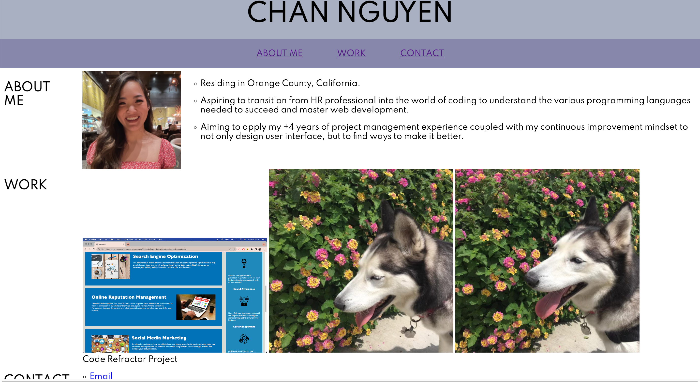
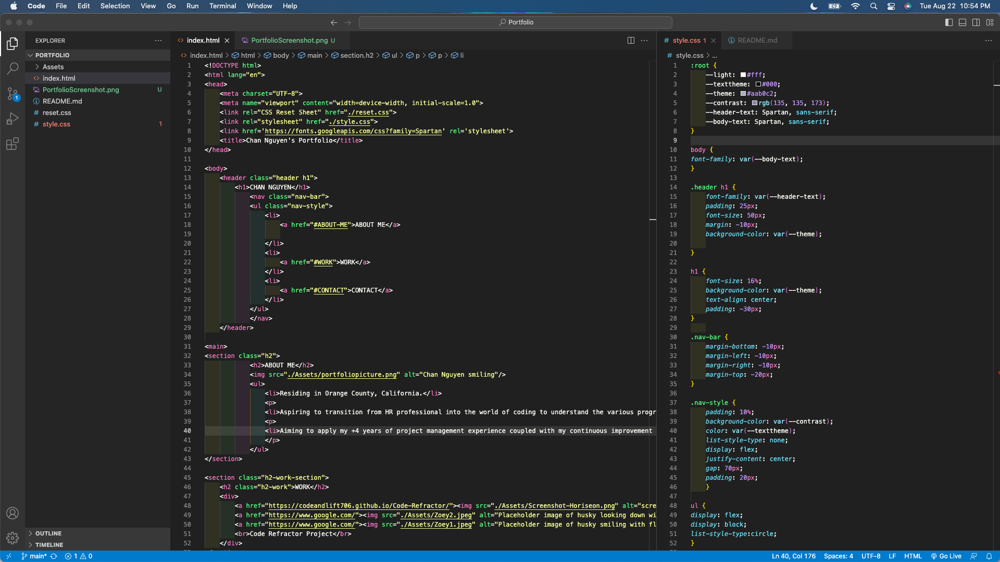

# CSS-Portfolio

## Table of Contents
- [Description](#description)
- [Installation](#installation)
- [Usage](#usage)
- [License](#license)
- [Contribution](#contribution)
- [Questions](#questions)

## Description
The goal of creating a portfolio web page is to showcase projects, contact information, and share an about me section. The deployed application can be found here: https://codeandlift706.github.io/Portfolio/.

## Installation
VS Code to create and manipulate HTML and CSS elements for the web page. GitHub for version control and web page deployment.

## Usage
Users can use this as a portfolio template.

View a screenshot of the web page here:

View a screenshot of the VS Code here:

## Contribution
The CSS Reset Sheet code can be obtained here: https://meyerweb.com/eric/tools/css/reset/. The flexbox properties used can be found here: https://css-tricks.com/snippets/css/a-guide-to-flexbox/.
How I formatted List style without bullet points: https://www.w3schools.com/html/tryit.asp?filename=tryhtml_lists_unordered_none.
How I fixed the margin of the header: https://stackoverflow.com/questions/14423781/how-can-i-remove-space-margin-around-an-html-header.
What I used to pick the font “Spartan”: https://www.w3schools.com/howto/tryit.asp?font=Montserrat.
How I aligned text can be found here: https://css-tricks.com/almanac/properties/t/text-align/#:~:text=The%20text%2Dalign%20property%20in,aligns%20along%20the%20left%20side.
How I found the code for mailto: https://www.w3docs.com/snippets/html/how-to-create-mailto-links.html.
How I was able to give links to images: https://www.w3schools.com/html/tryit.asp?filename=tryhtml_links_image.
To complete the README with screenshots, the source for the code is: https://stackoverflow.com/questions/10189356/how-to-add-screenshot-to-readmes-in-github-repository. To complete the README section, the source is: https://www.makeareadme.com/. The remaining edits that were made are credited to the curriculum taught in the UCI coding boot camp (ex: HTML semantics).

## Questions
The link to my Github Profile here: https://github.com/codeandlift706.
For any additional questions, please reach me at: channguyen715@gmail.com.
